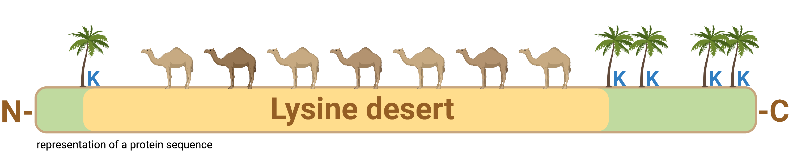

Data accompanying the manuscript "Lysine-deficient proteome can be regulated through non-canonical ubiquitination and ubiquitin-independent proteasomal degradation"

===================

# Overview

This repository contains codes and auxiliary data to article "Lysine-deficient proteome can be regulated through non-canonical ubiquitination and ubiquitin-independent proteasomal degradation" by Szulc et al., 2023.

# What is a lysine desert and why is it important?

Lysine desert is a continuous lysine-less region of a protein. Such lysine deserts have been shown to counteract the ubiquitin-dependent turnover of equipped proteins. Understanding the role of such regions in protein functioning and degradation can shed new light on the regulation of the ubiquitin-proteasome system and play role in the development of targeted protein degradation therapies, as VHL, a crucial E3 ligase in proteolysis targeting chimeras (PROTACs) development, has an extensive lysine deserts, which elongated in the course of evolution.

# Installation

Recommended usage of the jupyter notebooks deposited in this repository is in a conda environment.

## Conda environment

1. Install conda

      Please refer to the [conda manual](https://docs.conda.io/projects/conda/en/latest/user-guide/install/index.html) and install the conda version with Python 3.x according to your operating system.

2. Clone the repository

      `git clone https://github.com/n-szulc/fingernat.git`

3. Create conda environment

      `conda env create -f /environment.yml`

# Repository architecture

There are four main directories with codes required for performing analyses described in Szulc et al., 2013, namely `Proteomes_analysis`, `OGs_analysis`, `Human_proteome_detailed_analysis`, and `Structral_lysine_deserts_search`. The `Experimental_data` directory contain raw luminescence and fluorescence measurements from cycloheximide chase and NanoBRET ubiquitination assays ().

Each of the abovementioned directories contains two jupyter notebooks: `Download_data.ipynb` and `Pipeline.ipynb`. `Download_data.ipynb` is required to run prior `Pipeline.ipynb` as it allows to download data for the analyses.

All the notebooks are extensively documented with all the analyses' steps described.

## Order of computational analyses

Codes from `Proteomes_analysis` and `OGs_analysis` may be run independently from other analyses.

The order for performing analyses from `Human_proteome_detailed_analysis` and `Structral_lysine_deserts_search` is as follows:
1. `Proteomes_analysis/Download_data.ipynb`
2. `Structral_lysine_deserts_search/Download_data.ipynb`
3. `Human_proteome_detailed_analysis/Download_data`
4. `Human_proteome_detailed_analysis/Pipeline.ipynb`
5. `Structral_lysine_deserts_search/Pipeline.ipynb`

# Supplementary tables

All supplementary tables generated during this study are deposited in subdirectories of appropriate analyses and accompanied by README files with description of their content and each column.
